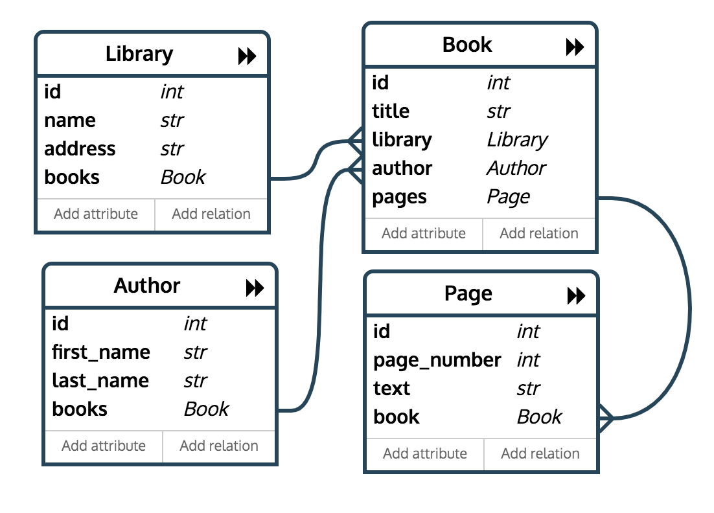

This guide covers the content in the folder **Model**

## What is a model?

A model is a representation of your object in the database. Django uses by default a relational database such as SQL lite. A relational database is organized into tables where data is stored in [key-value pairs](https://content.codecademy.com/courses/sql-intensive/table.jpg)


There are different ways to define a relationship between elements in the database:

- `OneToOneField` represents a [one-to-one relationship](https://docs.djangoproject.com/en/2.0/topics/db/examples/one_to_one/)
- `ForeignKey` represents a [many-to-one relationship](https://docs.djangoproject.com/en/2.0/topics/db/examples/many_to_one/)
- `ManyToManyField` represents a [many-to-many relationship](https://docs.djangoproject.com/en/2.0/topics/db/examples/many_to_many/)


1) `Many-to-one relationships`. This can be the relationship between a car manufacturer and a car. A manufacturer can build different cars. But all the cars have one manufacturer in common.

```python

class Manufacturer(models.Model):
    # ...
    pass

class Car(models.Model):
    manufacturer = models.ForeignKey(Manufacturer, on_delete=models.CASCADE)
    # ...

```

2) `Many-to-many relationships`. For example, a Pizza has multiple Topping objects. A Topping can be on multiple pizzas and each Pizza has multiple toppings – here’s how you’d represent that:

```python

class Topping(models.Model):
    # ...
    pass

class Pizza(models.Model):
    # ...
    toppings = models.ManyToManyField(Topping)
```

3) `One-to-one relationships`  A OneToOneField would be like an Engine, where a Car object can have one and only one engine.`

```python
class Engine(models.Model):
    name = models.CharField(max_length=25)

    def __unicode__(self):
        return self.name

class Car(models.Model):
    name = models.CharField(max_length=25)
    engine = models.OneToOneField(Engine)

    def __unicode__(self):
        return self.name

```



Check [this video](https://www.youtube.com/watch?v=wIPHER2UBB4&t=61s) for a more visual explanation of the relationship between models.


## Create your model

Go to the your app folder and inside the models.py file add a model. The following is an example of a **many to one** relationship model:

```python
from django.db import models

class Author(models.Model):
    first_name = models.CharField(max_length=30)
    last_name = models.CharField(max_length=30)
    email = models.EmailField()
    
    def __str__(self):
        return self.first_name


class Article(models.Model):
    blog = models.ForeignKey(Author, on_delete=models.CASCADE) ##if we delete an Author, all articles associated with that author will get deleted. 
    title = models.CharField(max_length = 200)
    text = models.TextField(max_length = 500)
    pub_date = models.DateField()

    def __str__(self):
        return self.title
```

- Stage your migrations: `python manage.py makemigrations <appname>`
- Perform migrations (synchronize your models with your database): `python manage.py migrate`

2. The shell

 Learn more about making queries [here](https://docs.djangoproject.com/en/3.1/topics/db/queries/) and [here](https://docs.djangoproject.com/en/3.1/topics/db/queries/)

- In the terminal run `python manage.py shell`
- run `from my_app.models import Author`
- run `Author`, you should be returned a class
- run `Author.objects.all()`, to see the content of your database. You should see `<QuerySet []>` if empty

Create a few Authors:

- run `Author.objects.create(first_name= 'Vinny', last_name = 'G', email = 'vinny@gmail.com')`
- run `Author.objects.create(first_name= 'Pauly', last_name = 'D', email = 'paulyD@gmail.com')`

Create a few Article entries:

- run `from my_app.models import Article`
- run `Article`, you should be returned a class
- run `Article.objects.all()`, to see the content of your database. You should see `<QuerySet []>` if empty

Because the Article database table is linked to the Author table via Foreign Key, to create an Article object, we'll need to grab an Author entry first. We can use its ID to accomplish that.

- run `author = Author.objects.filter(first_name__startswith='Vinny')` returns a query set (list)
- `id = author[0].id` gets the ID of the first element in the query Set
- `author = Author.objects.get(id=id)` 
- run `Article.objects.create(blog = author, title = 'I love Jersey Shore', text = 'my friends are awesome', pub_date = '2009-11-11' )`

## Quick Lab: 

1) Create a new Author instance with your name
2) Create a new articles and link them to your profile and to Pauly D's profile.

Filtering:

- run `Article.objects.filter(title = 'I love Jersey Shore')`
- run `Article.objects.filter(title__startswith='<enter the beginning of an Article's title')`

- run `a = Article.objects.all()` to assign all posts to a variable
- run `a` to see all blog posts
- run `a[0]` to access the first element
- run `a[0].delete()` to delete the first element

How can I filter for all Author entries that are linked to `Alex`?

- run `Author.objects.filter(first_name= 'Vinny')`


## Superuser

Exit the shell typing `exit()`. Let's discover the Admin panel and see all the blog posts that we have created. In my_app > admin.py page add the following:

```python
from django.contrib import admin

from . import models

admin.site.register(models.Article)
admin.site.register(models.Author)
```
- In the terminal, make sure that the server is not running and type `python manage.py createsuperuser`
- Start the server with `python manage.py runserver`
- Go to` http://localhost:8000/admin/` to explore the page and add more blog posts.